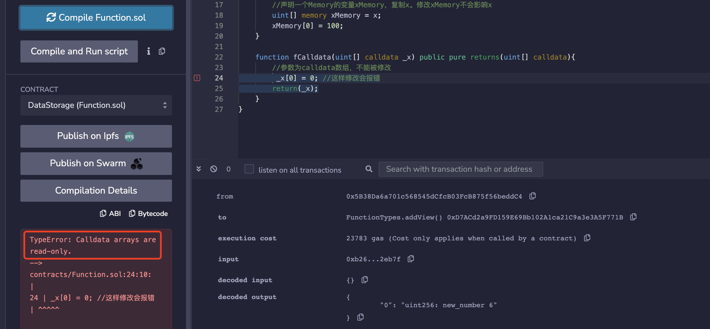
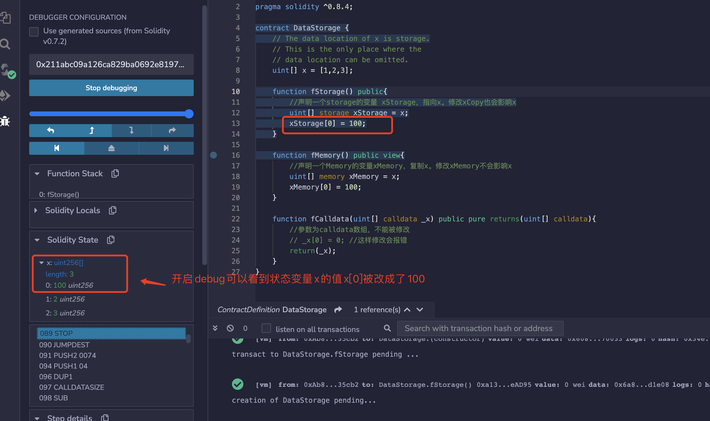
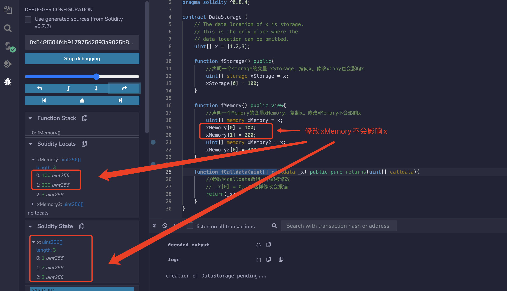

# Solidity极简入门: 5. 变量数据存储和作用域 storage/memory/calldata

我最近在重新学solidity，巩固一下细节，也写一个“Solidity极简入门”，供小白们使用（编程大佬可以另找教程），每周更新1-3讲。

欢迎关注我的推特：[@0xAA_Science](https://twitter.com/0xAA_Science)

WTF技术社群discord，内有加微信群方法：[链接](https://discord.gg/5akcruXrsk)

所有代码和教程开源在github（1024个star发课程认证，2048个star发社群NFT）: [github.com/AmazingAng/WTFSolidity](https://github.com/AmazingAng/WTFSolidity)

-----

## Solidity中的引用类型
**引用类型(Reference Type)**：包括数组（`array`），结构体（`struct`）和映射（`mapping`），这类变量占空间大，赋值时候直接传递地址（类似指针）。由于这类变量比较复杂，占用存储空间大，我们在使用时必须要声明数据存储的位置。

## 数据位置
solidity数据存储位置有三类：`storage`，`memory`和`calldata`。不同存储位置的`gas`成本不同。`storage`类型的数据存在链上，类似计算机的硬盘，消耗`gas`多；`memory`和`calldata`类型的临时存在内存里，消耗`gas`少。大致用法：

1. `storage`：合约里的状态变量默认都是`storage`，存储在链上。

2. `memory`：函数里的参数和临时变量一般用`memory`，存储在内存中，不上链。

3. `calldata`：和`memory`类似，存储在内存中，不上链。与`memory`的不同点在于`calldata`变量不能修改（`immutable`），一般用于函数的参数。例子：

```solidity
    function fCalldata(uint[] calldata _x) public pure returns(uint[] calldata){
        //参数为calldata数组，不能被修改
        // _x[0] = 0 //这样修改会报错
        return(_x);
    }
```
**Example:**


### 不同类型相互赋值时的规则
在不同存储类型相互赋值时候，有时会产生独立的副本（修改新变量不会影响原变量），有时会产生引用（修改新变量会影响原变量）。规则如下：

1. `storage`（合约的状态变量）赋值给本地`storage`（函数里的）时候，会创建引用，改变新变量会影响原变量。例子：
```solidity
    uint[] x = [1,2,3]; // 状态变量：数组 x

    function fStorage() public{
        //声明一个storage的变量 xStorage，指向x。修改xStorage也会影响x
        uint[] storage xStorage = x;
        xStorage[0] = 100;
    }
```
**Example:**


2. `storage`赋值给`memory`，会创建独立的复本，修改其中一个不会影响另一个；反之亦然。例子：
```solidity
    uint[] x = [1,2,3]; // 状态变量：数组 x
    
    function fMemory() public view{
        //声明一个Memory的变量xMemory，复制x。修改xMemory不会影响x
        uint[] memory xMemory = x;
        xMemory[0] = 100;
        xMemory[1] = 200;
        uint[] memory xMemory2 = x;
        xMemory2[0] = 300;
    }
```
**Example:**


3. `memory`赋值给`memory`，会创建引用，改变新变量会影响原变量。

4. 其他情况，变量赋值给`storage`，会创建独立的复本，修改其中一个不会影响另一个。

## 变量的作用域
`Solidity`中变量按作用域划分有三种，分别是状态变量（state variable），局部变量（local variable）和全局变量(global variable)
### 1. 状态变量
状态变量是数据存储在链上的变量，所有合约内函数都可以访问
，`gas`消耗高。状态变量在合约内、函数外声明：
```solidity
contract Variables {
    uint public x = 1;
    uint public y;
    string public z;
```

我们可以在函数里更改状态变量的值：
```solidity
    function foo() external{
        // 可以在函数里更改状态变量的值
        x = 5;
        y = 2;
        z = "0xAA";
    }
```

### 2. 局部变量
局部变量是仅在函数执行过程中有效的变量，函数退出后，变量无效。局部变量的数据存储在内存里，不上链，`gas`低。局部变量在函数内声明：
```solidity
    function bar() external pure returns(uint){
        uint xx = 1;
        uint yy = 3;
        uint zz = xx + yy;
        return(zz);
    }
```

### 3. 全局变量
全局变量是全局范围工作的变量，都是`solidity`预留关键字。他们可以在函数内不声明直接使用：

```solidity
    function global() external view returns(address, uint, bytes memory){
        address sender = msg.sender;
        uint blockNum = block.number;
        bytes memory data = msg.data;
        return(sender, blockNum, data);
    }
```
在上面例子里，我们使用了3个常用的全局变量：`msg.sender`, `block.number`和`msg.data`，他们分别代表请求发起地址，当前区块高度，和请求数据。下面是一些常用的全局变量，更完整的列表请看这个[链接](https://learnblockchain.cn/docs/solidity/units-and-global-variables.html#special-variables-and-functions)：

- `blockhash(uint blockNumber)`: (`bytes32`)给定区块的哈希值 – 只适用于256最近区块, 不包含当前区块。
- `block.coinbase`: (`address payable`) 当前区块矿工的地址
- `block.gaslimit`: (`uint`)	当前区块的gaslimit
- `block.number`: (`uint`)	当前区块的number
- `block.timestamp`: (`uint`)	当前区块的时间戳，为unix纪元以来的秒
- `gasleft()`: (`uint256`)	剩余 gas
- `msg.data`: (`bytes calldata`)	完整call data
- `msg.sender`: (`address payable`)	消息发送者 (当前 caller)
- `msg.sig`: (`bytes4`)	calldata的前四个字节 (function identifier)
- `msg.value`: (`uint`)	当前交易发送的`wei`值

**Example:**

## 总结
在第4讲，我们介绍了`solidity`中的引用类型，数据位置和变量的作用域。重点是`storage`, `memory`和`calldata`三个关键字的用法。他们出现的原因是为了节省链上有限的存储空间和降低`gas`。下一讲我们会介绍引用类型中的数组。

