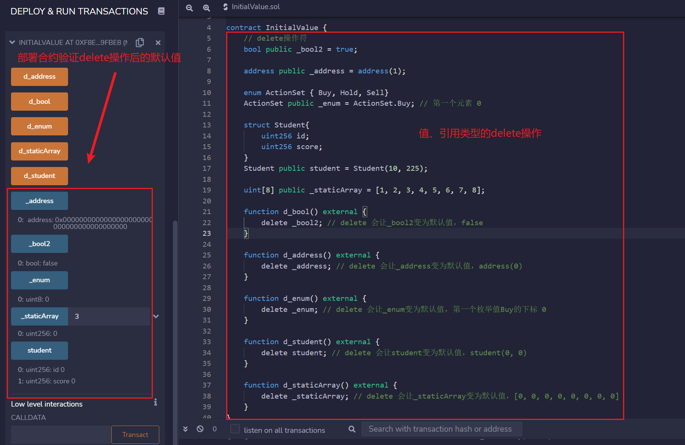

# Solidity极简入门: 8. 变量初始值

我最近在重新学solidity，巩固一下细节，也写一个“Solidity极简入门”，供小白们使用（编程大佬可以另找教程），每周更新1-3讲。

欢迎关注我的推特：[@0xAA_Science](https://twitter.com/0xAA_Science)

WTF技术社群discord，内有加微信群方法：[链接](https://discord.gg/5akcruXrsk)

所有代码和教程开源在github（1024个star发课程认证，2048个star发社群NFT）: [github.com/AmazingAng/WTFSolidity](https://github.com/AmazingAng/WTFSolidity)

-----

## 变量初始值

在`solidity`中，声明但没赋值的变量都有它的初始值或默认值。这一讲，我们将介绍常用变量的初始值。

### 值类型初始值

- `boolean`: `false`
- `string`: `""`
- `int`: `0`
- `uint`: `0`
- `enum`: 枚举中的第一个元素
- `address`: `0x0000000000000000000000000000000000000000` (或 `address(0)`)
- `function`
    - `internal`: 空白方程
    - `external`: 空白方程

可以用`public`变量的`getter`函数验证上面写的初始值是否正确：
```solidity
    bool public _bool; // false
    string public _string; // ""
    int public _int; // 0
    uint public _uint; // 0
    address public _address; // 0x0000000000000000000000000000000000000000

    enum ActionSet { Buy, Hold, Sell}
    ActionSet public _enum; // 第一个元素 0

    function fi() internal{} // internal空白方程 
    function fe() external{} // external空白方程 
```

### 引用类型初始值
- 映射`mapping`: 所有元素都为其默认值的`mapping`

- 结构体`struct`: 所有成员设为其默认值的结构体

- 数组`array`
    - 动态数组: `[]`
    - 静态数组（定长）: 所有成员设为其默认值的静态数组

可以用`public`变量的`getter`函数验证上面写的初始值是否正确：
```solidity
    // Reference Types
    uint[8] public _staticArray; // 所有成员设为其默认值的静态数组[0,0,0,0,0,0,0,0]
    uint[] public _dynamicArray; // `[]`
    mapping(uint => address) public _mapping; // 所有元素都为其默认值的mapping
    // 所有成员设为其默认值的结构体 0, 0
    struct Student{
        uint256 id;
        uint256 score; 
    }
    Student public student;
```

### `delete`操作符
`delete a`会让变量`a`的值变为初始值。
```solidity
    // delete操作符
    bool public _bool2 = true; 
    function d() external {
        delete _bool2; // delete 会让_bool2变为默认值，false
    }
```
## 在remix上验证
- 部署合约查看值类型、引用类型的初始值


- 值类型、引用类型delete操作后的默认值


## 总结
这一讲，我们介绍了`solidity`中变量的初始值。变量被声明但没有赋值的时候，它的值默认为初始值。不同类型的变量初始值不同，`delete`操作符可以删除一个变量的值并代替为初始值。

