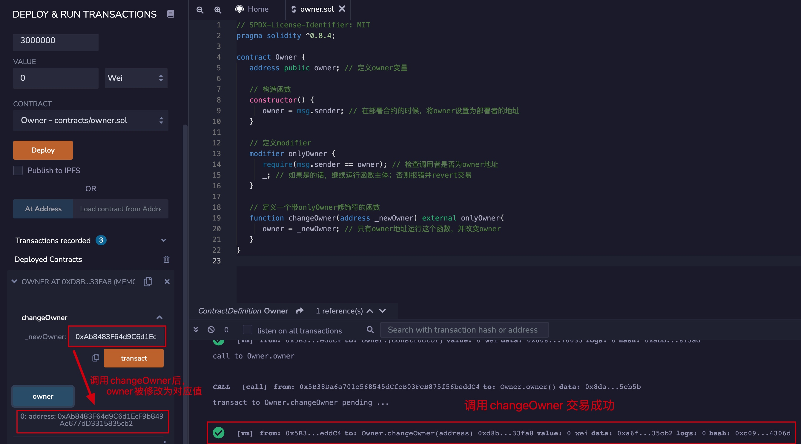
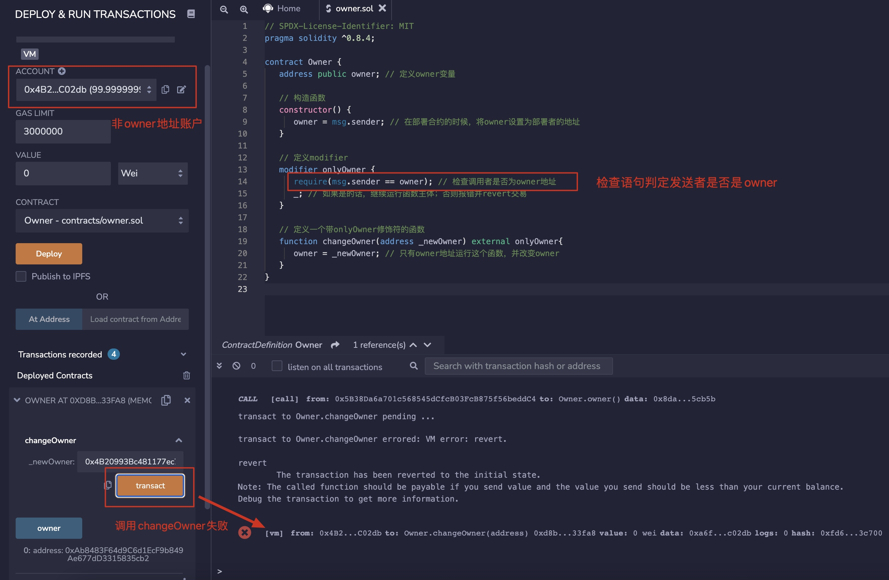

# Solidity极简入门: 11. 构造函数和修饰器

我最近在重新学solidity，巩固一下细节，也写一个“Solidity极简入门”，供小白们使用（编程大佬可以另找教程），每周更新1-3讲。

欢迎关注我的推特：[@0xAA_Science](https://twitter.com/0xAA_Science)

WTF技术社群discord，内有加微信群方法：[链接](https://discord.gg/5akcruXrsk)

所有代码和教程开源在github（1024个star发课程认证，2048个star发社群NFT）: [github.com/AmazingAng/WTFSolidity](https://github.com/AmazingAng/WTFSolidity)

-----

这一讲，我们将用合约权限控制（`Ownable`）的例子介绍`solidity`语言中构造函数（`constructor`）和独有的修饰器（`modifier`）。

## 构造函数
构造函数（`constructor`）是一种特殊的函数，每个合约可以定义一个，并在部署合约的时候自动运行一次。它可以用来初始化合约的一些参数，例如初始化合约的`owner`地址：
```solidity
   address owner; // 定义owner变量

   // 构造函数
   constructor() public {
      owner = msg.sender; // 在部署合约的时候，将owner设置为部署者的地址
   }
```

**注意**⚠️：构造函数在不同的solidity版本中的语法并不一致，在Solidity 0.4.22之前，构造函数不使用 `constructor` 而是使用与合约名同名的函数作为构造函数而使用，由于这种旧写法容易使开发者在书写时发生疏漏（例如合约名叫 `Parents`，构造函数名写成 `parents`），使得构造函数变成普通函数，引发漏洞，所以0.4.22版本及之后，采用了全新的 `constructor` 写法。

构造函数的旧写法代码示例：
```solidity
pragma solidity =0.4.21;
contract Parents {
    // 与合约名Parents同名的函数就是构造函数
    function Parents () public {
    }
}
```
## 修饰器
修饰器（`modifier`）是`solidity`特有的语法，类似于面向对象编程中的`decorator`，声明函数拥有的特性，并减少代码冗余。它就像钢铁侠的智能盔甲，穿上它的函数会带有某些特定的行为。`modifier`的主要使用场景是运行函数前的检查，例如地址，变量，余额等。


我们来定义一个叫做onlyOwner的modifier：
```solidity
   // 定义modifier
   modifier onlyOwner {
      require(msg.sender == owner); // 检查调用者是否为owner地址
      _; // 如果是的话，继续运行函数主体；否则报错并revert交易
   }
```
代有`onlyOwner`修饰符的函数只能被`owner`地址调用，比如下面这个例子：
```solidity
   function changeOwner(address _newOwner) external onlyOwner{
      owner = _newOwner; // 只有owner地址运行这个函数，并改变owner
   }
```
我们定义了一个`changeOwner`函数，运行他可以改变合约的`owner`，但是由于`onlyOwner`修饰符的存在，只有原先的`owner`可以调用，别人调用就会报错。这也是最常用的控制智能合约权限的方法。

### OppenZepplin的Ownable标准实现：
`OppenZepplin`是一个维护`solidity`标准化代码库的组织，他的`Ownable`标准实现如下：
[https://github.com/OpenZeppelin/openzeppelin-contracts/blob/master/contracts/access/Ownable.sol](https://github.com/OpenZeppelin/openzeppelin-contracts/blob/master/contracts/access/Ownable.sol)

## Remix 演示示例
以 `Owner.sol` 为例。
1. 在 Remix 上编译部署代码。
2. 点击 `owner` 按钮查看当前 owner 变量。
    
3. 以 owner 地址的用户身份，调用 `changeOwner` 函数，交易成功。
    
4. 以非 owner 地址的用户身份，调用 `changeOwner` 函数，交易失败，因为modifier onlyOwner 的检查语句不满足。
    


## 总结
这一讲，我们介绍了`solidity`中的构造函数和修饰符，并举了一个控制合约权限的`Ownable`合约。

