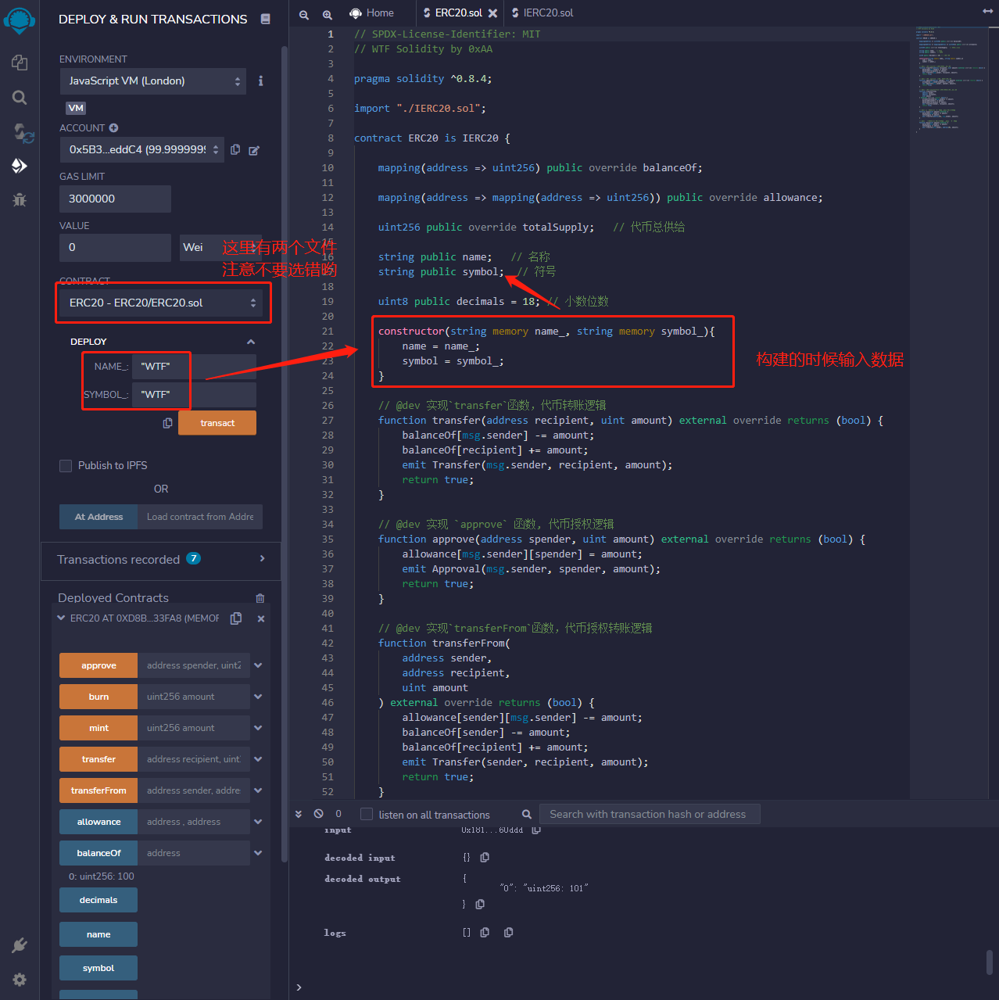

# Solidity极简入门: 31. ERC20

我最近在重新学solidity，巩固一下细节，也写一个“Solidity极简入门”，供小白们使用（编程大佬可以另找教程），每周更新1-3讲。

欢迎关注我的推特：[@0xAA_Science](https://twitter.com/0xAA_Science)

欢迎加入WTF科学家社区，内有加微信群方法：[链接](https://discord.gg/5akcruXrsk)

所有代码和教程开源在github（1024个star发课程认证，2048个star发社群NFT）: [github.com/AmazingAng/WTFSolidity](https://github.com/AmazingAng/WTFSolidity)

-----

这一讲，我们将介绍以太坊上的`ERC20`代币标准，并发行自己的测试代币。

## ERC20

`ERC20`是以太坊上的代币标准，来自2015年11月V神参与的[`EIP20`](https://eips.ethereum.org/EIPS/eip-20)。它实现了代币转账的基本逻辑：

- 账户余额
- 转账
- 授权转账
- 代币总供给
- 代币信息（可选）：名称，代号，小数位数

## IERC20
`IERC20`是`ERC20`代币标准的接口合约，规定了`ERC20`代币需要实现的函数和事件。
之所以需要定义接口，是因为有了规范后，就存在所有的`ERC20`代币都通用的函数名称，输入参数，输出参数。
在接口函数中，只需要定义函数名称，输入参数，输出参数，并不关心函数内部如何实现。
由此，函数就分为内部和外部两个内容，一个重点是实现，另一个是对外接口，约定共同数据。
这就是为什么需要`ERC20.sol`和`IERC20.sol`两个文件实现一个合约。

### 事件
`IERC20`定义了`2`个事件：`Transfer`事件和`Approval`事件，分别在转账和授权时被释放

```solidity
    /**
     * @dev 释放条件：当 `value` 单位的货币从账户 (`from`) 转账到另一账户 (`to`)时.
     */
    event Transfer(address indexed from, address indexed to, uint256 value);

    /**
     * @dev 释放条件：当 `value` 单位的货币从账户 (`owner`) 授权给另一账户 (`spender`)时.
     */
    event Approval(address indexed owner, address indexed spender, uint256 value);
```

### 函数
`IERC20`定义了`6`个函数，提供了转移代币的基本功能，并允许代币获得批准，以便其他链上第三方使用。

- `totalSupply()`返回代币总供给
```solidity
    /**
     * @dev 返回代币总供给.
     */
    function totalSupply() external view returns (uint256);
```

- `balanceOf()`返回账户余额
```solidity
    /**
     * @dev 返回账户`account`所持有的代币数.
     */
    function balanceOf(address account) external view returns (uint256);
```

- `transfer()`转账
```solidity
    /**
     * @dev 转账 `amount` 单位代币，从调用者账户到另一账户 `to`.
     *
     * 如果成功，返回 `true`.
     *
     * 释放 {Transfer} 事件.
     */
    function transfer(address to, uint256 amount) external returns (bool);
```

- `allowance()`返回授权额度
```solidity
    /**
     * @dev 返回`owner`账户授权给`spender`账户的额度，默认为0。
     *
     * 当{approve} 或 {transferFrom} 被调用时，`allowance`会改变.
     */
    function allowance(address owner, address spender) external view returns (uint256);
```

- `approve()`授权
```solidity
    /**
     * @dev 调用者账户给`spender`账户授权 `amount`数量代币。
     *
     * 如果成功，返回 `true`.
     *
     * 释放 {Approval} 事件.
     */
    function approve(address spender, uint256 amount) external returns (bool);
```

- `transferFrom()`授权转账
```solidity
    /**
     * @dev 通过授权机制，从`from`账户向`to`账户转账`amount`数量代币。转账的部分会从调用者的`allowance`中扣除。
     *
     * 如果成功，返回 `true`.
     *
     * 释放 {Transfer} 事件.
     */
    function transferFrom(
        address from,
        address to,
        uint256 amount
    ) external returns (bool);
```

## 实现ERC20

现在我们写一个`ERC20`，将`IERC20`规定的函数简单实现。

### 状态变量
我们需要状态变量来记录账户余额，授权额度和代币信息。其中`balanceOf`, `allowance`和`totalSupply`为`public`类型，会自动生成一个同名`getter`函数，实现`IERC20`规定的`balanceOf()`, `allowance()`和`totalSupply()`。而`name`, `symbol`, `decimals`则对应代币的名称，代号和小数位数。

```solidity
    mapping(address => uint256) public override balanceOf;

    mapping(address => mapping(address => uint256)) public override allowance;

    uint256 public override totalSupply;   // 代币总供给

    string public name;   // 名称
    string public symbol;  // 代号
    
    uint8 public decimals = 18; // 小数位数
```

### 函数
- 构造函数：初始化代币名称、代号。
```solidity
    constructor(string memory name_, string memory symbol_){
        name = name_;
        symbol = symbol_;
    }
```

- `transfer()`函数：实现`IERC20`中的`transfer`函数，代币转账逻辑。调用方扣除`amount`数量代币，接收方增加相应代币。土狗币会魔改这个函数，加入税收、分红、抽奖等逻辑。
```solidity
    function transfer(address recipient, uint amount) external override returns (bool) {
        balanceOf[msg.sender] -= amount;
        balanceOf[recipient] += amount;
        emit Transfer(msg.sender, recipient, amount);
        return true;
    }
```

- `approve()`函数：实现`IERC20`中的`approve`函数，代币授权逻辑。被授权方`spender`可以支配授权方的`amount`数量的代币。`spender`可以是EOA账户，也可以是合约账户：当你用`uniswap`交易代币时，你需要将代币授权给`uniswap`合约。

```solidity
    function approve(address spender, uint amount) external override returns (bool) {
        allowance[msg.sender][spender] = amount;
        emit Approval(msg.sender, spender, amount);
        return true;
    }
```

- `transferFrom()`函数：实现`IERC20`中的`transferFrom`函数，授权转账逻辑。被授权方将授权方`sender`的`amount`数量的代币转账给接收方`recipient`。
```solidity
    function transferFrom(
        address sender,
        address recipient,
        uint amount
    ) external override returns (bool) {
        allowance[sender][msg.sender] -= amount;
        balanceOf[sender] -= amount;
        balanceOf[recipient] += amount;
        emit Transfer(sender, recipient, amount);
        return true;
    }
```

- `mint()`函数：铸造代币函数，不在`IERC20`标准中。这里为了教程方便，任何人可以铸造任意数量的代币，实际应用中会加权限管理，只有`owner`可以铸造代币：
```solidity
    function mint(uint amount) external {
        balanceOf[msg.sender] += amount;
        totalSupply += amount;
        emit Transfer(address(0), msg.sender, amount);
    }
```

- `burn()`函数：销毁代币函数，不在`IERC20`标准中。
```solidity
    function burn(uint amount) external {
        balanceOf[msg.sender] -= amount;
        totalSupply -= amount;
        emit Transfer(msg.sender, address(0), amount);
    }
```

## 发行`ERC20`代币

有了`ERC20`标准后，在`ETH`链上发行代币变得非常简单。现在，我们发行属于我们的第一个代币。

在`Remix`上编译好`ERC20`合约，在部署栏输入构造函数的参数，`name_`和`symbol_`都设为`WTF`，然后点击`transact`键进行部署。



这样，我们就创建好了`WTF`代币。我们需要运行`mint()`函数来给自己铸造一些代币。点开`Deployed Contract`中的`ERC20`合约，在`mint`函数那一栏输入`100`并点击`mint`按钮，为自己铸造`100`个`WTF`代币。

可以点开右侧的Debug按钮，具体查看下面的logs。

里面包含四个关键信息：
- 事件`Transfer`
- 铸币地址`0x0000000000000000000000000000000000000000`
- 接收地址`0x5B38Da6a701c568545dCfcB03FcB875f56beddC4`
- 代币数额`100`


我们利用`balanceOf()`函数来查询账户余额。输入我们当前的账户，可以看到余额变为`100`，铸造成功。

账户信息如图左侧，右侧标注为函数执行的具体信息。


## 总结

在这一讲，我们学习了以太坊上的`ERC20`标准及其实现，并且发行了我们的测试代币。2015年底提出的`ERC20`代币标准极大的降低了以太坊上发行代币的门槛，并开启了`ICO`大时代。在投资时，仔细阅读项目的代币合约，可以有效避开貔貅，增加投资成功率。
