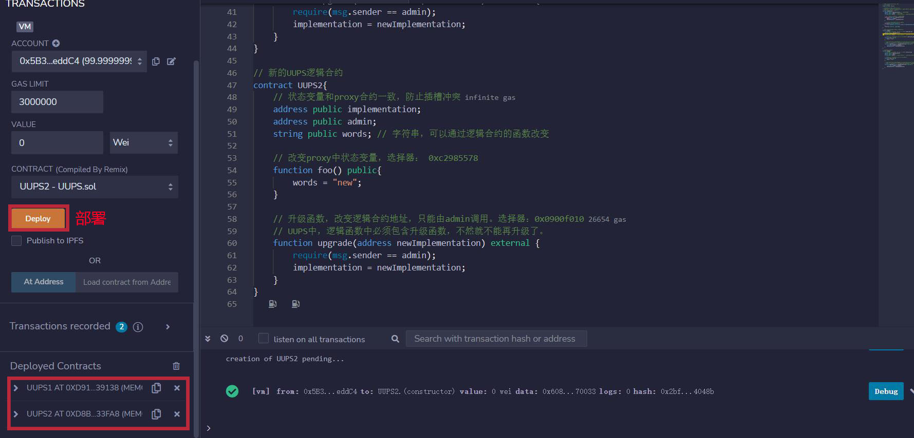
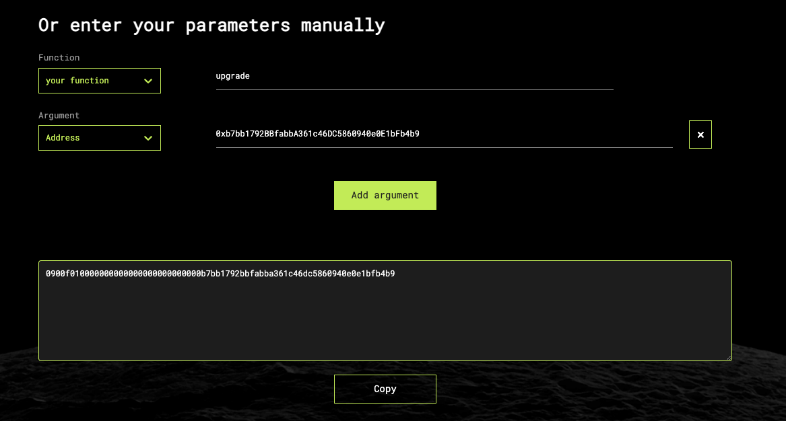

# WTF Solidity极简入门: 49. 通用可升级代理

我最近在重新学solidity，巩固一下细节，也写一个“WTF Solidity极简入门”，供小白们使用（编程大佬可以另找教程），每周更新1-3讲。

推特：[@0xAA_Science](https://twitter.com/0xAA_Science)

社区：[Discord](https://discord.wtf.academy)｜[微信群](https://docs.google.com/forms/d/e/1FAIpQLSe4KGT8Sh6sJ7hedQRuIYirOoZK_85miz3dw7vA1-YjodgJ-A/viewform?usp=sf_link)｜[官网 wtf.academy](https://wtf.academy)

所有代码和教程开源在github: [github.com/AmazingAng/WTFSolidity](https://github.com/AmazingAng/WTFSolidity)

-----

这一讲，我们将介绍代理合约中选择器冲突（Selector Clash）的另一个解决办法：通用可升级代理（UUPS，universal upgradeable proxy standard）。教学代码由`OpenZeppelin`的`UUPSUpgradeable`简化而成，不应用于生产。

## UUPS

我们在[上一讲](https://github.com/AmazingAng/WTFSolidity/blob/main/48_TransparentProxy/readme.md)已经学习了"选择器冲突"（Selector Clash），即合约存在两个选择器相同的函数，可能会造成严重后果。作为透明代理的替代方案，UUPS也能解决这一问题。

UUPS（universal upgradeable proxy standard，通用可升级代理）将升级函数放在逻辑合约中。这样一来，如果有其它函数与升级函数存在“选择器冲突”，编译时就会报错。

下表中概括了普通可升级合约，透明代理，和UUPS的不同点：


## UUPS合约

首先我们要复习一下[WTF Solidity极简教程第23讲：Delegatecall](https://github.com/AmazingAng/WTFSolidity/blob/main/23_Delegatecall/readme.md)。如果用户A通过合约B（代理合约）去`delegatecall`合约C（逻辑合约），语境仍是合约B的语境，`msg.sender`仍是用户A而不是合约B。因此，UUPS合约可以将升级函数放在逻辑合约中，并检查调用者是否为管理员。


### UUPS的代理合约

UUPS的代理合约看起来像是个不可升级的代理合约，非常简单，因为升级函数被放在了逻辑合约中。它包含`3`个变量：
- `implementation`：逻辑合约地址。
- `admin`：admin地址。
- `words`：字符串，可以通过逻辑合约的函数改变。

它包含`2`个函数

- 构造函数：初始化admin和逻辑合约地址。
- `fallback()`：回调函数，将调用委托给逻辑合约。

```solidity
contract UUPSProxy {
    address public implementation; // 逻辑合约地址
    address public admin; // admin地址
    string public words; // 字符串，可以通过逻辑合约的函数改变

    // 构造函数，初始化admin和逻辑合约地址
    constructor(address _implementation){
        admin = msg.sender;
        implementation = _implementation;
    }

    // fallback函数，将调用委托给逻辑合约
    fallback() external payable {
        (bool success, bytes memory data) = implementation.delegatecall(msg.data);
    }
}
```

### UUPS的逻辑合约

UUPS的逻辑合约与[第47讲](https://github.com/AmazingAng/WTFSolidity/blob/main/47_Upgrade/readme.md)中的不同是多了个升级函数。UUPS逻辑合约包含`3`个状态变量，与保持代理合约一致，防止插槽冲突。它包含`2`个
- `upgrade()`：升级函数，将改变逻辑合约地址`implementation`，只能由`admin`调用。
- `foo()`：旧UUPS逻辑合约会将`words`的值改为`"old"`，新的会改为`"new"`。

```solidity
// UUPS逻辑合约（升级函数写在逻辑合约内）
contract UUPS1{
    // 状态变量和proxy合约一致，防止插槽冲突
    address public implementation; 
    address public admin; 
    string public words; // 字符串，可以通过逻辑合约的函数改变

    // 改变proxy中状态变量，选择器： 0xc2985578
    function foo() public{
        words = "old";
    }

    // 升级函数，改变逻辑合约地址，只能由admin调用。选择器：0x0900f010
    // UUPS中，逻辑函数中必须包含升级函数，不然就不能再升级了。
    function upgrade(address newImplementation) external {
        require(msg.sender == admin);
        implementation = newImplementation;
    }
}

// 新的UUPS逻辑合约
contract UUPS2{
    // 状态变量和proxy合约一致，防止插槽冲突
    address public implementation; 
    address public admin; 
    string public words; // 字符串，可以通过逻辑合约的函数改变

    // 改变proxy中状态变量，选择器： 0xc2985578
    function foo() public{
        words = "new";
    }

    // 升级函数，改变逻辑合约地址，只能由admin调用。选择器：0x0900f010
    // UUPS中，逻辑函数中必须包含升级函数，不然就不能再升级了。
    function upgrade(address newImplementation) external {
        require(msg.sender == admin);
        implementation = newImplementation;
    }
}
```

## `Remix`实现

1. 部署UUPS新旧逻辑合约`UUPS1`和`UUPS2`。



2. 部署UUPS代理合约`UUPSProxy`，将`implementation`地址指向旧逻辑合约`UUPS1`。


3. 利用选择器`0xc2985578`，在代理合约中调用旧逻辑合约`UUPS1`的`foo()`函数，将`words`的值改为`"old"`。


4. 利用在线ABI编码器[HashEx](https://abi.hashex.org/)获得二进制编码，调用升级函数`upgrade()`，将`implementation`地址指向新逻辑合约`UUPS2`。




5. 利用选择器`0xc2985578`，在代理合约中调用新逻辑合约`UUPS2`的`foo()`函数，将`words`的值改为`"new"`。


## 总结

这一讲，我们介绍了代理合约“选择器冲突”的另一个解决方案：UUPS。与透明代理不同，UUPS将升级函数放在了逻辑合约中，从而使得"选择器冲突"不能通过编译。相比透明代理，UUPS更省gas，但也更复杂。
