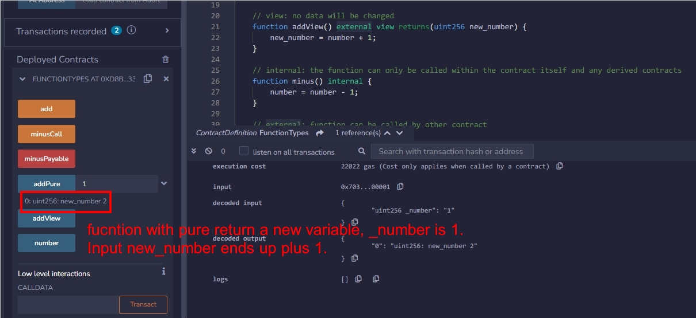
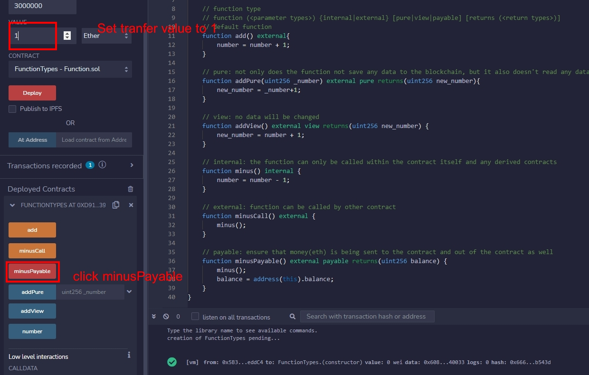

# Solidity Minimalist Primer: 3. Function type

Recently, I have been relearning the Solidity, consolidating the finer details, and also writing a "Solidity Minimalist Primer" for newbies to learn and use from (advanced programmers can find another tutorial). Lectures are updated 1~3 times weekly.

Everyone is welcomed to follow my Twitter: [@0xAA_Science](https://twitter.com/0xAA_Science)

WTF Solidity Discord: [Link](https://discord.gg/5akcruXrsk)

All codebase and tutorial notes are open source and available on GitHub (At 1024 repo stars, course certification is unlocked. At 2048 repo stars, community NFT is unlocked.): [github.com/AmazingAng/WTFSolidity](https://github.com/AmazingAng/WTFSolidity)

---

## Function in Solidity

Function is classified into values type by solidity document, but I put it a separate category, since there is a big difference in my opinion. Let's take a look of solidity function:

```solidity
    function (<parameter types>) {internal|external} [pure|view|payable] [returns (<return types>)]
```

kind of complicated, let's move forward one by one (keyword in square brackets is optional):

1. `function`: Start with the keyword function.

2. `(<parameter types>)`: Parameter in parentheses, which is the input of function variable type and name.

3. `{internal|external|public|private}`: Function visibility specifier, there are 4 kinds. `internal` is the default visibility level for state variables.

   - `public`: Visible both inside and outside (It can also be used to modify state variables. Public variables will automatically generate `getter` functions for querying values.).

   - `private`: Can only be accessed within this contract, derived contracts cannot used it（Can be used to decorate state variables as well）。

- `external`: Can only be called from other contracts（Can be called `this.f()`to use it, `f` is function name）
- `internal`: Can only be accessed internally，also works for contracts deriving from it（Can be used to decorate state variables as well）。

4. `[pure|view|payable]`: Keywords that determine function authentication/features. `payable` is easy to understand. Function with `payable` can send `ETH` to contracts. Intro of `pure` and `view` see next chapter.

5. `[returns ()]`: Function return variables' type and name.

## What is `Pure` and `View` after all?

When I started learning `solidity`, I didn't understand `pure` and `view` keywords, because there are no similar keywords in other languages. `solidity` added these two keywords, I think it is because of `gas fee`. The contract state variables are stored on block chain, `gas fee` is very expensive. If you don't rewrite the variables on the chain, you don't need to pay `gas`. Functions required `pure` and `view` don't need to pay `gas`.

I drew a Mario illustration to help you understand. In the picture, I put state variables (stored on chain) as Princess Bitch, three different roles represent different keywords.


- `pure` : Functions containing `pure` keyword cannot read nor write state variables on-chain. Just like the little monster, it can't see or touch Princess Bitch.

- `view` : Functions containing `view` keyword can read but can not write state variables. Similar to Mario, able to see Princess but can not get inside.

- Without `pure` and `view`: Functions can both read and write state variables. Like the `boss` can do whatever he wants.

## Code

### 1. pure v.s. view

We define a state variable `number = 5`

```solidity
    // SPDX-License-Identifier: MIT
    pragma solidity ^0.8.4;
    contract FunctionTypes{
        uint256 public number = 5;
```

Define a `add()` function, return `number + 1` every time function called.

```solidity
    // 默认
    function add() external{
        number = number + 1;
    }
```

If `add()` contains `pure` keyword, i.e. `function add() pure external`, will occur error because `pure` can not read state variable in contract nor write. So what can `pure` do ? i.e. you can pass a parameter `_number` to function, then it returns `_number + 1`.

```solidity
    // pure
    function addPure(uint256 _number) external pure returns(uint256 new_number){
        new_number = _number+1;
    }
```

**Example:**


If `add()` contains `view` also occur error, i.e. `function add() view external`. Because `view` can read, but can not write state variable. Modify code to not able to write `number` but return a new variable.

```solidity
    // view: 看客
    function addView() external view returns(uint256 new_number) {
        new_number = number + 1;
    }
```

**Example:**


### 2. internal v.s. external

```solidity
    // internal
    function minus() internal {
        number = number - 1;
    }

    // external
    function minusCall() external {
        minus();
    }
```

Define a `internal` `minus()` function, `number` will decrease 1 each time function called. Since function with `internal` can only be called within the contract itself. Therefore, we need to define a `external` `minusCall()` function to call `minus()` internally.
**Example:**


### 3. payable

```solidity
    // payable: ensure that money(eth) is being sent to the contract and out of the contract as well
    function minusPayable() external payable returns(uint256 balance) {
        minus();
        balance = address(this).balance;
    }
```

Define a `external payable` `minusPayable()` function, call `minus()` indirectly, and return `ETH` balance in contract (`this` keyword can let us query contract address). We can send 1 `ETH` to the contract while calling `minusPayable()`.


We can see contract balance is 1 `ETH` in return message.


**Example:**


## Tutorial summary

In this section, we introduced `solidity` function type, the ones that are difficult to understand are `pure` and `view`, which have not appeared in other languages. `pure` and `view` in solidity mainly for saving `gas` and function auth, these two don't need to pay `gas`.
