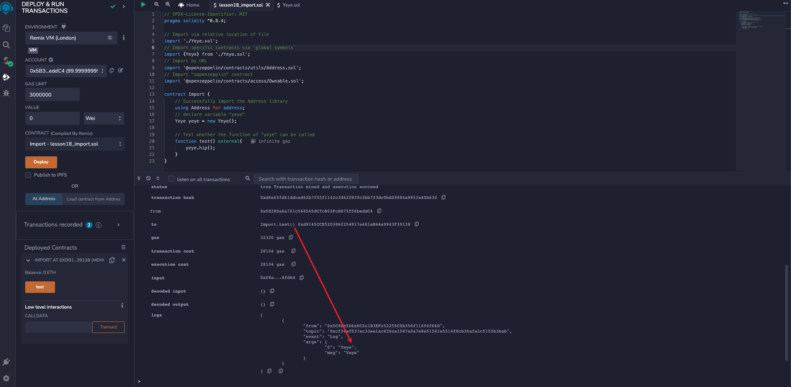

# WTF Solidity Tutorial: 18. Import

Recently, I have been relearning Solidity, consolidating the finer details, and also writing a "WTF Solidity Tutorial" for newbies to learn. Lectures are updated 1~3 times weekly. 

Everyone is welcomed to follow my Twitter: [@0xAA_Science](https://twitter.com/0xAA_Science)

WTF Academy Discord, where you can find the way to join WeChat group: [Link](https://discord.gg/5akcruXrsk)

All codebase and tutorial notes are open source and available on GitHub (At 1024 repo stars, course certification is unlocked. At 2048 repo stars, community NFT is unlocked.): [github.com/AmazingAng/WTFSolidity](https://github.com/AmazingAng/WTFSolidity)

-----

`solidity` supports the use of `import` keyword to import global symbols in other contracts 
(simply understood as external source code), making development more modular. Generally, 
if not specified, all global symbols of the imported file will be imported into the current global scope.

## Usage of `import`

- Import by relative location of source file. For example：

```
Hierarchy
├── Import.sol
└── Yeye.sol

// Import by relative location of source file
import './Yeye.sol';
```

- Import the global symbols of contracts on the Internet through the source file URL. For example：
```
// Import by URL
import 'https://github.com/OpenZeppelin/openzeppelin-contracts/blob/master/contracts/utils/Address.sol';
```

- Import via `npm` directory. For example:
```solidity
import '@openzeppelin/contracts/access/Ownable.sol';
```

- Import contract-specific global symbols by specifying `global symbols`. For example:：
```solidity
import {Yeye} from './Yeye.sol';
```

- The location of the reference (`import`) in the code: after declaring the version, and before the rest of the code.

## Test `import`

We can use the following code to test whether the external source code was successfully imported:

```solidity
contract Import {
    // Successfully import the Address library
    using Address for address;
    // declare variable "yeye"
    Yeye yeye = new Yeye();

    // Test whether the function of "yeye" can be called
    function test() external{
        yeye.hip();
    }
}
```



## Summary
In this lecture, we introduced the method of importing external source code using the `import` keyword. Through the `import`, 
you can refer to contracts or functions in other files written by us, 
or directly import code written by others, which is very convenient.
