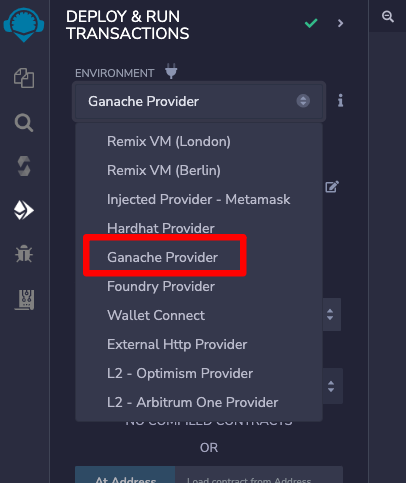

# Solidity极简入门-工具篇3：Ganache，搭建本地测试网络

我最近在重新学solidity，巩固一下细节，也写一个“Solidity极简入门”，供小白们使用），每周更新1-3讲。

欢迎关注我的推特：[@0xAA_Science](https://twitter.com/0xAA_Science)

WTF技术社群discord，内有加微信群方法：[链接](https://discord.gg/5akcruXrsk)

所有代码和教程开源在github: [github.com/AmazingAng/WTFSolidity](https://github.com/AmazingAng/WTFSolidity)

-----
`Ganache` 是一个以太坊模拟器，它使开发以太坊应用程序更快、更容易、更安全。它包括所有流行的 RPC 功能和特性（如事件），并且可以确定性地运行以使开发变得轻而易举。

## 为什么要使用Ganache

有的时候想要实现合约的测试，或者一些合约开发，你需要去测试网领取eth，有时候faucet又没有eth可以领取，这个时候，其实你可以选择自己在本地fork一个网络，想要多少eth都可以直接生成。原理是fork一个主网的网络，并跑在你的本地。

fork主网还有一个好处，你可以直接mock现在主网上的所有环境，比如dex交易所的代币余额等，你知道合约地址，可以直接进行测试和交换使用等。


## 命令行安装（推荐）

[完整包的说明ganache - npm](https://www.npmjs.com/package/ganache)
```shell
npm install ganache --global
```


### 启动GANACHE

```shell
ganache
```


### fork主网启动

以下命令会自动生成10个eth账号，每个账号带有100eth的数量。

```shell
ganache -f https://eth-mainnet.alchemyapi.io/v2/YOUR_API_KEY
```


### Fork主网固定账号启动

`wallet.accounts`主要参数为私钥和需要生成的eth数量。

注意单位为`wei`，案例中换算之后是`1000eth`

```shell
ganache -f https://eth-mainnet.alchemyapi.io/v2/YOUR_API_KEY --wallet.accounts=ACCOUNT_PRIATE_KEY,AMOUNT_WEI --wallet.accounts=ACCOUNT_PRIATE_KEY,1000000000000000000000
```


## web3js/ethersjs 链接 ganache
ganache生成的本地rpc地址为 `127.0.0.1:8545` UI的默认地址和命令行有区别，所以我上述做了变更。像remix默认使用的就是8454端口

```js

// web3js

const web3 = new Web3(Web3.givenProvider || "http://127.0.0.1:8545");

// ethersjs
const provider = new ethers.providers.JsonRpcProvider("http://127.0.0.1:8545");

```

## remix链接本地ganache

把环境链接修改为 ganache即可没，这样你就可以把他部署在你本地的eth网络环境上了。




### 测试部署合约

这里就将合约部署在了我们本地运行的ganache上。


命令行会输出部署的相应细节


可以看到部署成功之后，可以方便的调用各种方法


### 部署合约，查询v神余额

这个合约写了一个可以查询eth余额的方法，因为我们fork了主网，所以查询一下v神在我们本地测试网络的余额，应该和主网的余额是一样的。

```solidity
// contracts/GLDToken.sol†
// SPDX-License-Identifier: MIT
pragma solidity ^0.8.0;

contract XBXToken {

    function getETHBalance(address _address) view external returns(uint256) {
        return address(_address).balance;
    }

}

```

[v神主网钱包地址](https://etherscan.io/address/0xab5801a7d398351b8be11c439e05c5b3259aec9b)


通过remix调用查看fork之后，本地部署该地址余额


本地fork的网络查询v神余额与主网上的余额一致，fork主网测试成功。

## 总结

至此我们就完整fork了一个主网，为下一步做合约开发搭建好了必要的本地环境。